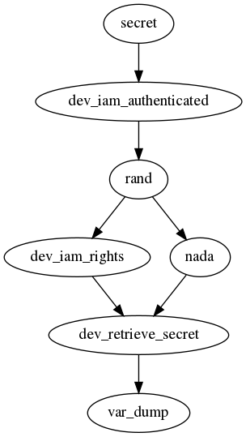

# Customize an analysis

In addition to the [**specification of taint analysis**](./SPECIFY_ANALYSIS.md) it is possible to create custom rules.

## Call graph checking

To verify that your program meets a given specification use the below kind of rule (`MUST_VERIFY_CALL_FLOW` action) which will traverse the call graph (only from the main function) of a program to check, in this exemple, if a user is authenticated and has the permission before retrieving a possible secret.

```javascript
{
    "custom_rules": [
        {
            "sequence":
            [
                {"function_name": "dev_iam_authenticated", "language": "php"},
                {"function_name": "dev_iam_rights", "language": "php"},
                {"function_name": "dev_retrieve_secret", "language": "php"}
            ],
            "description": "rule #1 not verified",
            "action": "MUST_VERIFY_CALL_FLOW"
        }]
}
```

The call graph of the following code:
```php
<?php

function secret()
{
    dev_iam_authenticated();
    
    if(1 == rand())
    {
        dev_iam_rights();
    }
    else
    {
        nada();
    }
    
    var_dump(dev_retrieve_secret());
}

secret();

```

has one path that does not verify the above rule #1, thus this last will be raised:  
<p align=center>

</p>

## Restricted function calls

To verify if a function call comply with defined conditions use this kind of rule (`MUST_NOT_VERIFY_DEFINITION` and `MUST_VERIFY_DEFINITION` actions), in this example Twig auto escaping strategy is verified:

```javascript
{
    "name": "__construct",
    "is_function": true,
    "instanceof": "Twig_Environment",
    "parameters": 
    [
        {"id": 2, "values": 
            [ 
                {"value" : "false", "is_array": true, "array_index": "autoescape"} 
            ]}
    ], 
    "description": "Twig_Environment autoescaping should be set to true",
    "language": "php", 
    "action": "MUST_NOT_VERIFY_DEFINITION",
    "attack": "security misconfiguration", 
    "cwe": "CWE_1004"
}
```

In the below code the conditions of the custom rule set on the `Twig_Environment` function call are not satisfied:
```php
<?php

$a = new Twig_Environment($loader, array("autoescape" => false));


```

## Create an object

The return of a function could be a custom object of a class name defined in the `extra` property:  

```javascript
        {
            "name": "query", 
            "is_function": true,
            "instanceof": "CI_Model->db", 
            "description": "Result of db queries as new sources",
            "language": "php", 
            "action": "DEFINE_OBJECT", 
            "extra": "DBQueryCodeIgniter"
        }
}
```

Thus it's possible to use this class name when [defining sources, sinks, sanitizers or validators](./SPECIFY_ANALYSIS.md).
